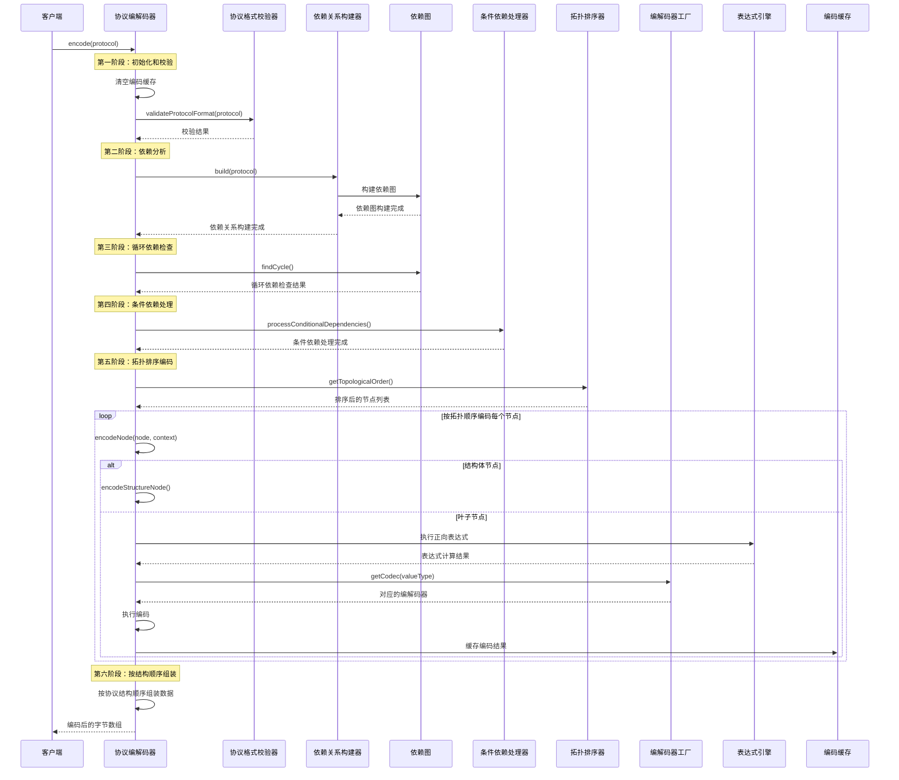
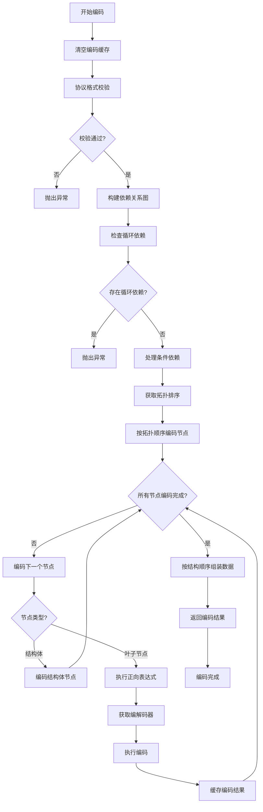
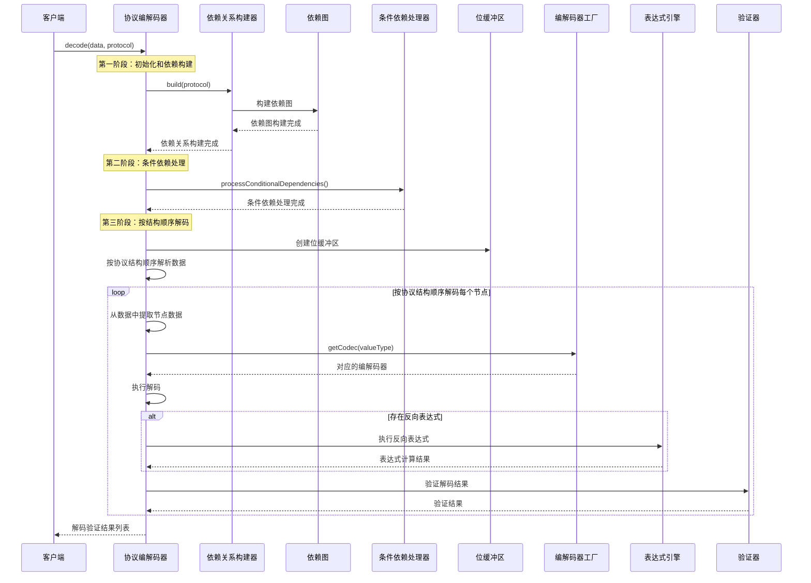
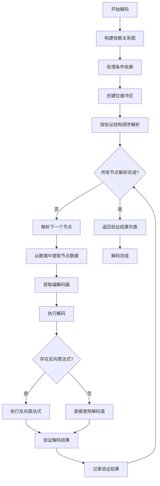

# 协议编制与反演模块设计文档

## 1. 模块概述

### 1.1 设计目标
协议编制与反演模块是一个高性能、可扩展的二进制协议编解码系统，旨在解决复杂协议的数据序列化和反序列化问题。该模块采用分层架构设计，支持动态表达式计算、条件依赖处理、填充策略等多种高级特性。

### 1.2 核心特性
- **智能依赖管理**：基于拓扑排序的节点依赖关系处理
- **动态表达式计算**：支持Aviator表达式引擎的复杂计算
- **条件依赖处理**：支持协议变体和条件性节点启用/禁用
- **多策略填充**：提供多种填充策略满足协议对齐要求
- **高性能编解码**：基于策略模式的类型化编解码器
- **完整性验证**：通过反演验证确保编码的正确性

## 2. 系统架构设计

### 2.1 整体架构图

```
┌─────────────────────────────────────────────────────────────────┐
│                        协议编制与反演模块                          │
├─────────────────────────────────────────────────────────────────┤
│  ┌─────────────┐  ┌─────────────┐  ┌─────────────┐              │
│  │   协议配置   │  │   协议实例   │  │   源码数据   │               │
│  │   (配置类)   │  │   (对象实例) │  │  (字节数组) │                │
│  └─────────────┘  └─────────────┘  └─────────────┘              │
├─────────────────────────────────────────────────────────────────┤
│  ┌───────────────────────────────────────────────────────────── ┐
│  │                    协议解析层                               │ │
│  │  ┌─────────────┐  ┌─────────────┐  ┌─────────────┐        │ │
│  │  │ 协议类解析器 │  │ 协议节点组   │  │ 协议验证器   │        │ │
│  │  │             │  │   解析器     │  │             │        │ │
│  │  └─────────────┘  └─────────────┘  └─────────────┘        │ │
│  └─────────────────────────────────────────────────────────────┘ │
├─────────────────────────────────────────────────────────────────┤
│  ┌─────────────────────────────────────────────────────────────┐ │
│  │                    表达式引擎层                             │ │
│  │  ┌─────────────┐  ┌─────────────┐  ┌─────────────┐        │ │
│  │  │ Aviator表达式│  │ 表达式解析器 │  │ 表达式验证器 │        │ │
│  │  │    引擎     │  │             │  │             │        │ │
│  │  └─────────────┘  └─────────────┘  └─────────────┘        │ │
│  └─────────────────────────────────────────────────────────────┘ │
├─────────────────────────────────────────────────────────────────┤
│  ┌─────────────────────────────────────────────────────────────┐ │
│  │                    依赖管理层                               │ │
│  │  ┌─────────────┐  ┌─────────────┐  ┌─────────────┐        │ │
│  │  │   依赖图    │  │ 拓扑排序器   │  │ 条件依赖    │        │ │
│  │  │             │  │             │  │   处理器     │        │ │
│  │  └─────────────┘  └─────────────┘  └─────────────┘        │ │
│  └─────────────────────────────────────────────────────────────┘ │
├─────────────────────────────────────────────────────────────────┤
│  ┌─────────────────────────────────────────────────────────────┐ │
│  │                    编解码核心层                             │ │
│  │  ┌─────────────┐  ┌─────────────┐  ┌─────────────┐        │ │
│  │  │ 协议编解码器 │  │ 编解码器工厂 │  │ 填充处理器   │        │ │
│  │  │             │  │             │  │             │        │ │
│  │  └─────────────┘  └─────────────┘  └─────────────┘        │ │
│  └─────────────────────────────────────────────────────────────┘ │
├─────────────────────────────────────────────────────────────────┤
│  ┌─────────────────────────────────────────────────────────────┐ │
│  │                    编解码器实现层                           │ │
│  │  ┌─────────────┐  ┌─────────────┐  ┌─────────────┐        │ │
│  │  │  位编解码器  │  │  整数编解码器│  │  字符串编    │        │ │
│  │  │  (BitCodec) │  │(SignedIntCodec│  │  解码器     │        │ │
│  │  │             │  │UnsignedIntCodec│  │(StringCodec)│        │ │
│  │  └─────────────┘  └─────────────┘  └─────────────┘        │ │
│  │  ┌─────────────┐  ┌─────────────┐                        │ │
│  │  │ 十六进制编   │  │  浮点数编    │                        │ │
│  │  │  解码器     │  │  解码器     │                        │ │
│  │  │(HexCodec)   │  │(FloatCodec) │                        │ │
│  │  └─────────────┘  └─────────────┘                        │ │
│  └─────────────────────────────────────────────────────────────┘ │
└─────────────────────────────────────────────────────────────────┘
```

### 2.2 核心组件说明

#### 2.2.1 协议解析层
- **ProtocolClassParser**：通过反射解析协议配置类，构建协议结构
- **ProtocolNodeGroupResolver**：解析协议节点组，处理复杂嵌套结构
- **ProtocolValidator**：验证协议配置的正确性和完整性

#### 2.2.2 表达式引擎层
- **AviatorExpressionEngine**：基于Aviator的高性能表达式计算引擎
- **ExpressionParser**：解析表达式中的依赖关系
- **ExpressionValidator**：验证表达式语法和引用有效性

#### 2.2.3 依赖管理层
- **DependencyGraph**：管理节点间的依赖关系，构建依赖图
- **TopologicalSorter**：执行拓扑排序，确定节点处理顺序
- **ConditionalDependencyProcessor**：处理条件依赖，支持协议变体

#### 2.2.4 编解码核心层
- **ProtocolCodec**：核心编解码器，协调整个编解码过程
- **CodecFactory**：编解码器工厂，管理不同类型的编解码器
- **PaddingProcessor**：处理各种填充策略

#### 2.2.5 编解码器实现层
- **BitCodec**：位级数据编解码，支持二进制数据的精确位操作
- **SignedIntCodec**：有符号整数编解码，支持正负整数的序列化
- **UnsignedIntCodec**：无符号整数编解码，支持非负整数的序列化
- **StringCodec**：字符串编解码，支持多种字符集和编码方式
- **HexCodec**：十六进制数据编解码，支持十六进制字符串的转换
- **FloatCodec**：浮点数编解码，支持单精度和双精度浮点数

## 3. 核心设计原理

### 3.1 分离关注点原则
- **编码职责**：将协议对象转换为字节数组，处理数据序列化
- **解码职责**：验证编码正确性，通过反演确保数据一致性
- **依赖管理**：独立处理节点间的依赖关系，确保处理顺序正确

### 3.2 依赖图驱动设计
- **拓扑排序**：通过依赖图确定节点的正确处理顺序
- **循环检测**：自动检测并报告循环依赖问题
- **动态依赖**：支持运行时动态计算节点依赖关系

### 3.3 表达式计算支持
- **正向表达式**：编码时对节点值进行转换或计算
- **反向表达式**：解码时进行数据转换验证
- **函数扩展**：支持自定义函数，如CRC16、长度计算等

### 3.4 策略模式应用
- **编解码器策略**：不同数据类型使用不同的编解码策略
- **填充策略**：支持多种填充方式，如零填充、位填充等
- **条件策略**：支持多种条件判断和节点启用策略

## 4. 协议编制（编码）流程

### 4.1 编码时序图



### 4.2 编码流程图



### 4.3 编码阶段详解

#### 4.3.1 协议格式校验阶段
```java
// 在指令编制前对协议格式进行全面的校验
protocolFormatValidator.validateProtocolFormat(protocol);
```
**校验内容：**
- 节点值范围检查
- 长度配置验证
- 枚举值有效性
- 表达式语法验证
- 节点配置完整性

#### 4.3.2 依赖分析阶段
```java
// 构建节点依赖关系图
ProtocolDependencyBuilder depBuilder = new ProtocolDependencyBuilder(
    expressionParser, expressionValidator, dependencyGraph);
depBuilder.build(protocol);
```
**依赖类型：**
- **表达式依赖**：节点值依赖其他节点的值或长度
- **填充依赖**：填充节点依赖其他节点的值
- **条件依赖**：节点启用依赖条件表达式

#### 4.3.3 拓扑排序编码阶段
```java
// 按拓扑顺序编码节点，确保依赖节点先处理
List<String> sortedNodes = dependencyGraph.getTopologicalOrder();
for (String nodePath : sortedNodes) {
    ProtocolNode node = dependencyGraph.getNode(nodePath);
    byte[] encodedData = encodeNode(node, context);
    encodedNodesCache.put(node.getId(), encodedData);
}
```

#### 4.3.4 结构顺序组装阶段
```java
// 按协议定义的结构顺序组装最终数据
byte[] headerData = encodedNodesCache.get(header.getId());
byte[] bodyData = encodedNodesCache.get(body.getId());
byte[] tailData = encodedNodesCache.get(tail.getId());
// 组装为完整的协议数据
```

## 5. 协议反演（解码）流程

### 5.1 解码时序图



### 5.2 解码流程图



### 5.3 解码验证原理

#### 5.3.1 验证导向设计
```java
/**
 * 解码不是为了重建协议，而是为了验证编码的正确性
 * 从编码数据中按位置截取各节点数据，反向解码后与原始值比较
 */
public List<Node> decode(byte[] data, Protocol protocol) throws CodecException {
    // 按协议结构顺序解码数据
    BitBuffer buffer = new BitBuffer(data);
    List<Node> decodedNodes = new ArrayList<>();
    
    // 解码协议头部
    if (protocol.getHeader() != null) {
        Node headerNode = decodeProtocolSection(buffer, protocol.getHeader(), "header");
        decodedNodes.add(headerNode);
    }
    
    // 解码协议体
    if (protocol.getBody() != null) {
        Node bodyNode = decodeProtocolSection(buffer, protocol.getBody(), "body");
        decodedNodes.add(bodyNode);
    }
    
    // 解码协议尾部
    if (protocol.getTail() != null) {
        Node tailNode = decodeProtocolSection(buffer, protocol.getTail(), "tail");
        decodedNodes.add(tailNode);
    }
    
    return decodedNodes;
}
```

#### 5.3.2 位置精确解析
```java
/**
 * 按协议结构顺序精确定位每个节点在数据中的位置
 * 任何顺序错误都会导致数据位置偏移，无法正确解码
 */
private void validateAndFillNodeDecoding(byte[] sourceData, Node node, 
                                       Map<String, Object> context) throws CodecException {
    // 从源码数据反编出值
    Object decodedValue = codec.decode(sourceData, node, context);
    
    // 执行反向表达式（如果存在）
    if (StringUtils.isNotEmpty(node.getBwdExpr())) {
        context.put("value", decodedValue);
        Object transformedValue = expressionEngine.evaluate(node.getBwdExpr(), context);
        // 使用对应的比较器进行比较
        isEqual = compareValues(originalValue, transformedValue, node.getValueType(), node);
    } else {
        isEqual = compareValues(originalValue, decodedValue, node.getValueType(), node);
    }
    
    // 记录验证结果
    node.setValidationResult(isEqual);
    node.setValidationStatus(isEqual ? "成功" : "失败");
}
```

## 6. 关键设计模式

### 6.1 策略模式（Strategy Pattern）
```java
/**
 * 编解码器工厂 - 根据值类型获取对应的编解码器
 * 设计原因：遵循策略模式，不同的数据类型使用不同的编解码策略
 */
public class CodecFactory {
    private final Map<ValueType, Codec> codecMap = new HashMap<>();
    
    public Codec getCodec(ValueType valueType) throws CodecException {
        Codec codec = codecMap.get(valueType);
        if (codec == null) {
            throw new CodecException("未找到值类型 " + valueType + " 的编解码器");
        }
        return codec;
    }
}
```

### 6.2 工厂模式（Factory Pattern）
```java
/**
 * 自动注册所有编解码器
 */
private void registerCodec() {
    registerCodec(new BitCodec());
    registerCodec(new FloatCodec());
    registerCodec(new HexCodec());
    registerCodec(new SignedIntCodec());
    registerCodec(new StringCodec());
    registerCodec(new UnsignedIntCodec());
}
```

### 6.3 模板方法模式（Template Method Pattern）
```java
/**
 * 编码单个节点 - 将节点转换为字节数组
 */
private byte[] encodeNode(ProtocolNode node, Map<String, Object> context) throws CodecException {
    // 1. 检查节点类型
    if (node.isStructureNode()) {
        return encodeStructureNode(node, context);
    }
    
    // 2. 获取对应的编解码器
    Codec codec = codecFactory.getCodec(node.getValueType());
    
    // 3. 执行正向表达式计算（如果存在）
    if (StringUtils.isNotEmpty(node.getFwdExpr())) {
        Object result = expressionEngine.evaluate(node.getFwdExpr(), context);
        node.setValue(result);
    }
    
    // 4. 执行编码
    return codec.encode(node, context);
}
```

### 6.4 观察者模式（Observer Pattern）
```java
/**
 * 依赖图管理器 - 维护节点间的依赖关系
 */
public class DependencyGraph {
    // 记录每个节点的前置依赖节点（被该节点依赖的节点）
    private final Map<String, Set<String>> prerequisiteNodes = new HashMap<>();
    
    public void addDependency(String from, String to) throws CodecException {
        // 添加依赖关系：from 依赖 to
        graph.get(to).add(from);
        
        // 更新前置依赖节点集合
        prerequisiteNodes.get(to).add(from);
    }
}
```

## 7. 性能优化策略

### 7.1 缓存机制
```java
/**
 * 已编码节点缓存 - 存储节点ID到编码数据的映射
 * 设计原因：
 * 1. 避免重复编码：节点可能被多个表达式引用，缓存避免重复计算
 * 2. 支持依赖引用：后续节点可以引用已编码节点的数据
 * 3. 结构体组装：结构体节点需要组装子节点的编码数据
 * 4. 性能优化：减少重复的编码操作
 */
private final Map<String, byte[]> encodedNodesCache = new HashMap<>();
```

### 7.2 表达式缓存
```java
/**
 * 表达式缓存 - 避免重复编译表达式
 */
private static final Map<String, Expression> expressionCache = new ConcurrentHashMap<>();

public Object evaluate(String expression, Map<String, Object> context) throws ExpressionException {
    // 使用缓存的编译后表达式，提高执行性能
    Expression compiledExpression = expressionCache.computeIfAbsent(
        expression, engine::compile);
    return compiledExpression.execute(context);
}
```

### 7.3 依赖图优化
```java
/**
 * 拓扑排序优化 - 使用队列实现高效的拓扑排序
 */
public List<String> getTopologicalOrder() {
    Queue<String> queue = new LinkedList<>();
    Map<String, Integer> currentInDegree = new HashMap<>(inDegree);
    
    // 将所有入度为0的节点加入队列
    for (Map.Entry<String, Integer> entry : currentInDegree.entrySet()) {
        if (entry.getValue() == 0) {
            queue.offer(entry.getKey());
        }
    }
    
    // 主循环：处理入度为0的节点
    while (!queue.isEmpty()) {
        String node = queue.poll();
        result.add(node);
        
        // 更新邻接节点的入度
        for (String neighbor : graph.getOrDefault(node, new LinkedHashSet<>())) {
            int oldInDegree = currentInDegree.getOrDefault(neighbor, 0);
            currentInDegree.put(neighbor, oldInDegree - 1);
            
            if (currentInDegree.get(neighbor) == 0) {
                queue.offer(neighbor);
            }
        }
    }
    
    return result;
}
```

## 8. 错误处理与异常管理

### 8.1 异常层次结构
```java
/**
 * 编解码异常基类
 */
public class CodecException extends Exception {
    public CodecException(String message) {
        super(message);
    }
    
    public CodecException(String message, Throwable cause) {
        super(message, cause);
    }
}

/**
 * 表达式异常
 */
public class ExpressionException extends Exception {
    public ExpressionException(String message) {
        super(message);
    }
    
    public ExpressionException(String message, Throwable cause) {
        super(message, cause);
    }
}
```

### 8.2 错误恢复机制
```java
/**
 * 编码失败时的错误恢复
 */
private byte[] encodeNode(ProtocolNode node, Map<String, Object> context) throws CodecException {
    // 保存原始值
    Object originalValue = node.getValue();
    
    try {
        // 执行编码逻辑
        if (StringUtils.isNotEmpty(node.getFwdExpr())) {
            Object result = expressionEngine.evaluate(node.getFwdExpr(), context);
            node.setValue(result);
        }
        
        Codec codec = codecFactory.getCodec(node.getValueType());
        return codec.encode(node, context);
        
    } catch (Exception e) {
        // 恢复节点原始值
        node.setValue(originalValue);
        throw new CodecException("编码节点失败: " + node.getName(), e);
    }
}
```

## 9. 扩展性设计

### 9.1 自定义函数扩展
```java
/**
 * 自动注册aviator包下的所有自定义函数
 */
private void registerAviatorFunctions() {
    engine.addFunction(new CRC16Function());
    engine.addFunction(new DateFromDaysFunction());
    engine.addFunction(new DaysFromBaseFunction());
    engine.addFunction(new LeftShiftFunction());
    engine.addFunction(new LengthFunction());
    engine.addFunction(new MillisFromMidnightFunction());
    engine.addFunction(new RightShiftFunction());
    engine.addFunction(new SecondsFromMidnightFunction());
    engine.addFunction(new TimeFromMillisFunction());
    engine.addFunction(new TimeFromSecondsFunction());
    engine.addFunction(new ValueFunction());
    engine.addFunction(new VerifyCRC16Function());
    engine.addFunction(new SetLengthFunction());
}
```

### 9.2 编解码器扩展
```java
/**
 * 自动注册所有编解码器
 * 支持6种值类型：BIT、INT、UINT、FLOAT、HEX、STRING
 */
private void registerCodec() {
    // 注册所有内置编解码器
    registerCodec(new BitCodec());           // 位编解码器
    registerCodec(new FloatCodec());         // 浮点数编解码器
    registerCodec(new HexCodec());           // 十六进制编解码器
    registerCodec(new SignedIntCodec());     // 有符号整数编解码器
    registerCodec(new StringCodec());        // 字符串编解码器
    registerCodec(new UnsignedIntCodec());   // 无符号整数编解码器
    
    // 支持动态扫描和注册新的编解码器
    Set<Class<?>> classes = ClassUtil.scanPackage("com.iecas.cmd.codec.impl");
    classes.forEach(aClass -> {
        Object o = ReflectUtil.newInstance(aClass);
        registerCodec((Codec) o);
    });
}
```

## 10. 使用示例

### 10.1 基本编码示例
```java
// 创建协议编解码器
ProtocolCodec codec = new ProtocolCodec();

// 创建协议对象
SimpleProtocol protocol = new SimpleProtocol();
protocol.setHeader(0x01);
protocol.setBody("Hello World");
protocol.setLength(11);

// 编码协议
byte[] encodedData = codec.encode(protocol);
System.out.println("编码结果: " + ByteUtil.bytesToHexString(encodedData));
```

### 10.2 基本解码示例
```java
// 解码验证
List<Node> decodedNodes = codec.decode(encodedData, protocol);

// 检查验证结果
for (Node node : decodedNodes) {
    System.out.println("节点: " + node.getName() + 
                      ", 验证结果: " + node.getValidationStatus());
}
```

### 10.3 源码解析示例
```java
// 解析源码数据为协议对象实例
byte[] sourceData = {0x01, 0x0B, 0x48, 0x65, 0x6C, 0x6C, 0x6F, 
                     0x20, 0x57, 0x6F, 0x72, 0x6C, 0x64};
SimpleProtocol parsedProtocol = codec.parse(sourceData, new SimpleProtocol());

System.out.println("解析结果: " + parsedProtocol);
```

## 11. 支持的编解码器类型详解

### 11.1 位编解码器（BitCodec）
- **支持类型**：`ValueType.BIT`
- **功能特性**：支持精确的位级操作，包括位读取、位写入、位掩码等
- **应用场景**：协议标志位、状态位、控制位等需要位级精度的场景
- **编码方式**：按位打包，支持自定义位长度

### 11.2 有符号整数编解码器（SignedIntCodec）
- **支持类型**：`ValueType.INT`
- **功能特性**：支持正负整数的序列化和反序列化
- **数据范围**：根据位长度确定，如8位：-128~127，16位：-32768~32767
- **字节序**：支持大端序和小端序配置

### 11.3 无符号整数编解码器（UnsignedIntCodec）
- **支持类型**：`ValueType.UINT`
- **功能特性**：支持非负整数的序列化和反序列化
- **数据范围**：根据位长度确定，如8位：0~255，16位：0~65535
- **应用场景**：长度字段、计数器、标识符等

### 11.4 浮点数编解码器（FloatCodec）
- **支持类型**：`ValueType.FLOAT`
- **功能特性**：支持单精度（32位）和双精度（64位）浮点数
- **精度控制**：支持自定义小数位数和舍入模式
- **特殊值**：支持NaN、无穷大等特殊浮点值

### 11.5 十六进制编解码器（HexCodec）
- **支持类型**：`ValueType.HEX`
- **功能特性**：支持十六进制字符串与字节数组的相互转换
- **格式支持**：支持带前缀（0x）和不带前缀的十六进制格式
- **应用场景**：MAC地址、序列号、校验和等十六进制数据

### 11.6 字符串编解码器（StringCodec）
- **支持类型**：`ValueType.STRING`
- **功能特性**：支持多种字符集和编码方式
- **字符集支持**：UTF-8、ASCII、GBK等常用字符集
- **长度处理**：支持固定长度和可变长度字符串
- **填充策略**：支持空字符填充、空格填充等

### 11.7 编解码器扩展机制
```java
/**
 * 自定义编解码器示例
 */
public class CustomCodec implements Codec {
    @Override
    public ValueType[] getSupportedValueTypes() {
        return new ValueType[]{ValueType.CUSTOM}; // 自定义类型
    }
    
    @Override
    public byte[] encode(ProtocolNode node, Map<String, Object> context) throws CodecException {
        // 自定义编码逻辑
        return customEncode(node, context);
    }
    
    @Override
    public Object decode(byte[] data, ProtocolNode node, Map<String, Object> context) throws CodecException {
        // 自定义解码逻辑
        return customDecode(data, node, context);
    }
}
```

## 12. 总结

协议编制与反演模块采用现代化的软件设计理念，通过分层架构、策略模式、依赖图管理等技术手段，实现了一个高性能、可扩展、易维护的协议编解码系统。

### 12.1 设计亮点
1. **智能依赖管理**：基于拓扑排序的依赖关系处理，确保节点按正确顺序处理
2. **动态表达式计算**：支持复杂的动态计算，提高协议的灵活性
3. **条件依赖处理**：支持协议变体，满足复杂业务场景需求
4. **高性能设计**：缓存机制、策略模式等优化手段，确保系统性能
5. **完整性验证**：通过反演验证确保编码的正确性
6. **全面编解码支持**：支持6种数据类型的完整编解码器实现

### 12.2 技术优势
1. **架构清晰**：分层设计，职责明确，便于理解和维护
2. **扩展性强**：支持自定义函数、编解码器等扩展
3. **性能优异**：多种优化策略，确保系统高效运行
4. **错误处理完善**：完善的异常处理和错误恢复机制
5. **文档详细**：丰富的注释和文档，便于开发和使用
6. **类型覆盖全面**：涵盖位、整数、浮点、字符串、十六进制等所有常用数据类型

该模块为复杂协议的编解码提供了完整的解决方案，能够满足各种复杂的业务需求，是一个设计优秀、实现完善的软件模块。
